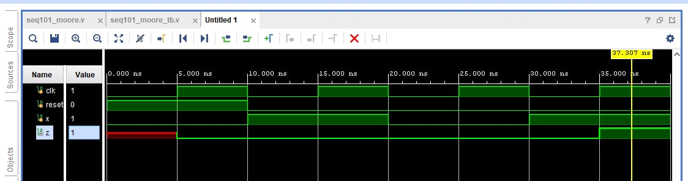
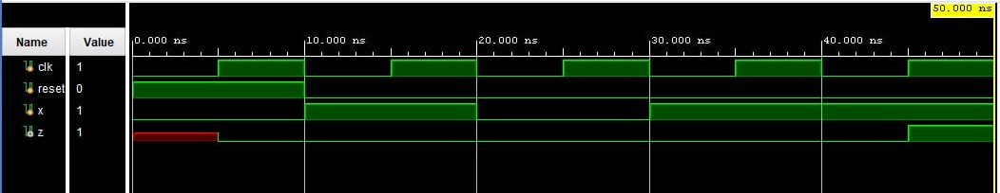

# Moore Overlapping Sequence Detector

## Overview

This project implements Moore finite state machines (FSMs) for detecting binary sequences using Verilog HDL.

The project includes two **overlapping sequence detectors**:

* `101`
* `1011`

In a Moore machine, the output depends only on the **current state**. The detector is designed to recognize the required sequence while allowing overlapping occurrences.

## Project Structure

```text
moore-overlapping-sequence-detector/
│
├── README.md
│
├── 101/
│   ├── moore_101.v
│   └── moore_101_tb.v
│
└── 1011/
    ├── moore_1011.v
    └── moore_1011_tb.v
```

## Sequence Detectors

### 1. Moore Overlapping Sequence Detector — 101

The FSM detects the sequence `101`.

When the complete sequence is detected, the Moore machine enters the output state where:

```text
z = 1
```

The detector is overlapping, meaning that the FSM does not necessarily return to the initial state after detection. This allows a new sequence to begin using bits that were already part of the previous detected sequence.

### 2. Moore Overlapping Sequence Detector — 1011

The FSM detects the sequence `1011`.

Similar to the `101` detector, the output becomes `1` when the FSM reaches the state representing successful detection of the complete sequence.

## Implementation

**HDL:** Verilog

**Design type:** Moore FSM

**Detection type:** Overlapping

**Sequences:** `101`, `1011`

Each detector contains:

* FSM state definition
* State transition logic
* Moore output logic
* Verilog testbench for simulation

## Simulation

The corresponding testbenches are included in each directory.

They apply different input sequences to the FSM and verify the detector output.

### Moore Overlapping Sequence Detector — 101

The following waveform shows the simulation of the `101` overlapping sequence detector.



### Moore Overlapping Sequence Detector — 1011

The following waveform shows the simulation of the `1011` overlapping sequence detector.



## Learning Outcomes

Through this project, the following concepts were practiced:

* Finite State Machines
* Moore FSM design
* Overlapping sequence detection
* State transition design
* Verilog HDL
* Verilog testbenches
* Digital circuit simulation
